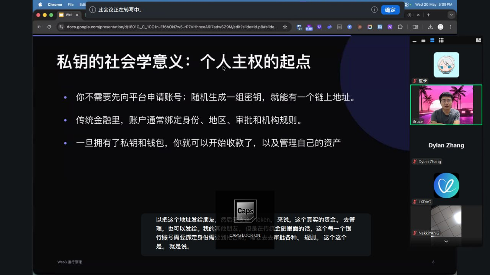
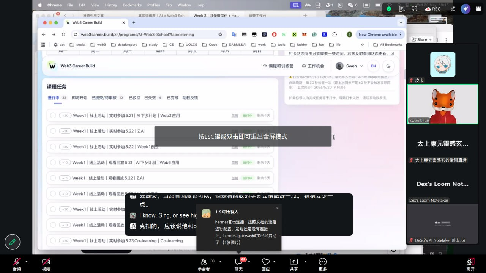

# 2026-05-20 周三

## 🎙️ Web3 运行原理（17:00-18:00）

**关键收获：**

之前对链上操作的认知是零散的——钱包是钱包，Gas是Gas，合约是合约。今天串起来才明白这是一条完整的链路：

私钥签名 → 构造交易 → 付Gas → 节点打包进区块 → 合约执行 → 区块浏览器可查。每一步都有验证，少一个环节整条链都不认。

对我比较有用的是理解了 **EOA 和合约地址的本质区别**——EOA 是人控制的（私钥签名发起交易），合约地址是代码控制的（被交易触发才执行）。这直接解释了我之前困惑的问题：为什么 Agent 不能直接用 EOA 钱包，而需要智能账户/AA 来做权限管理。

**下一步：** 趁热把测试网交易做了，实际走一遍「签名→发送→查浏览器」的流程。

---

## 🎙️ Co-learning 任务推进与答疑（19:00-20:00）

**关键收获：**

今晚主要跟着大家推任务进度。几个点：

1. 确认了这周 PoW Pack 的提交截止线和格式要求——所有 task proof 汇总到一个 daily note 里比分散提交更清晰，reviewer 一眼看完
2. 测试网交易卡在领水这一步——Sepolia 水龙头经常限流，有人分享了替代方案（Holesky 测试网 + QuickNode 水龙头），明天试一下
3. 有人展示了用 Hermes Agent 自动提交任务的 workflow，思路是先让 Agent 写好 proof → 人工 review → 一键提交，比自己手动快很多

**下一步：** 明天早上先搞定测试网交易（换 Holesky 试试），然后推智能合约部署。

---

## 🔗 任务提交

- Web3 运行原理 实时参加 → ✅ 已提交 (20pts)
- Co-learning 实时参加 → ✅ 已提交 (20pts)
- AI × Web3 交叉流程图 → ✅ 已提交 (30pts)
