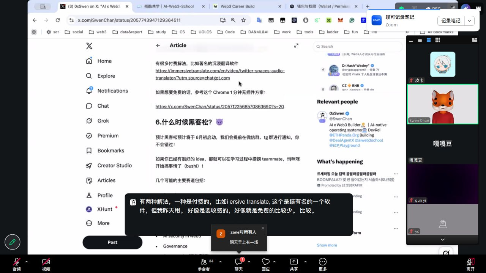

# 2026-05-22 (周五) Day 5

## 📋 今日任务

| 任务 | 积分 | 状态 |
|------|------|------|
| 部署/调用最小智能合约 | 30 | ⬜ |
| 比较 EOA/智能账户/多签 | 30 | ⬜ |
| 拆解 AI×Web3 项目 | 30 | ⬜ |
| Co-learning 实时参加 | 20 | ✅ |
| Week 1 例会 实时参加 | 20 | ✅ |

---

## 🎙️ 19:00 Co-learning｜任务推进与答疑

**主题：** 任务推进与答疑

**内容概要：** 主要梳理了整个 Week 1 的计划流程，包括任务拆解方法、proof 整理规范、以及 Week 1 收尾节奏。讲到了如何把大任务拆成可执行的小步骤，提交的 proof 要对应 proofPrompt 逐项检查。

**关键收获：** 理清了 Week 1 的任务优先级和提交流程——先把合约部署、EOA多签对比这些动手任务做了，最后统一打包 PoW Pack，不用每个单独纠结。

**下一步行动：** 明天先把合约部署和 EOA/多签对比搞定，然后集中提交 Week 1 收尾任务。

**截图：** 

---

## 🎙️ 20:00 Week 1 例会

**主题：** 优秀笔记分享、答疑、下周课程预告

**内容概要：** 例会展示了 Week 1 几位同学的高质量笔记和 proof 整理方式，分享了一些学习心得和踩坑经验。还预告了 Week 2 的方向——会更偏项目实战和 Hackathon 选题准备。

**关键收获：** 看了别人的笔记才发现 proof 整理可以更结构化——截图+分类+逐条对应 proofPrompt，比零散堆放清晰很多，下周照着来。

**下一步行动：** Week 2 的笔记从一开始就按这个模板来，避免收尾时返工。

**截图：** 

---

## 🔗 提交链接

- Co-learning 实时参加: proof-0522-colearning.jpg + 本日 daily note
