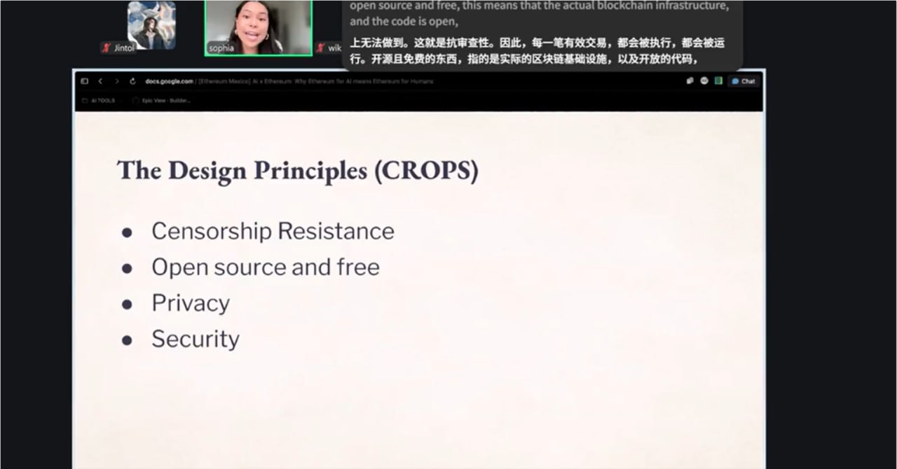

# 2026-05-23 (周六) Day 6 — Week 1 最后一天

## 📋 今日任务

| 任务 | 积分 | 状态 |
|------|------|------|
| Open Agentic Economy 实时参加 | 20 | ✅ |
| 比较 EOA/智能账户/多签 | 30 | ⬜ |
| 拆解 AI×Web3 项目 | 30 | ⬜ |
| 发布学习总结 | 20 | ⬜ |
| PoW Pack | 40 | ⬜ |

---

## 🎙️ 09:30 Open Agentic Economy: From ERC-8004 / ERC-8183 to Builder Path

**内容概要：** 讲了 Agentic Economy 的前沿方向——ERC-8004 和 ERC-8183 这些新标准怎么连接 Agent、支付、身份、验证，打通机器自主经济的全链路。还聊了 Builder 的切入路径，从协议层到应用层的各种可能性。

**关键收获：** Agent 支付不只是"让 AI 花钱"，背后是一整套身份→授权→验证→结算的协议栈。ERC-8004 做的是可编程支付意图，ERC-8183 偏机器身份和授权，跟我关注的 Agent Wallet 方向直接相关。

**下一步行动：** 把这两个标准放进 Week 2 的重点研究方向，结合 Agent Wallet + Payment Commerce 的赛道深入看。

**截图：** 
