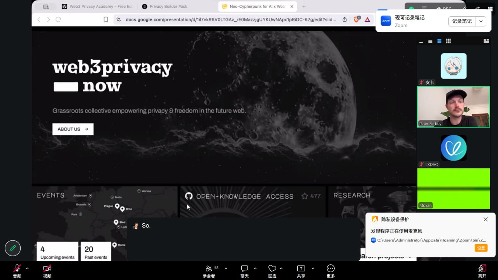

# 2026-05-27 学习记录

## 今日活动

### 5.27 直播｜Neo-Cypherpunk & the Cultural Layers of Privacy: Why Privacy Matters for Builders

**状态：** ✅ 已参加

**参与截图：**

**关键收获：**
隐私不只是技术问题，更是一种文化选择。Neo-Cypherpunk 强调在 AI 时代，builder 需要从设计之初就考虑隐私保护，而不是事后补救。Agent 在链上自主执行时，如何平衡透明性和隐私性是一个核心挑战——既不能让 Agent 完全黑箱，也不能把所有意图暴露在链上。对于 Agent 支付方向，这是一个值得深挖的维度。

**下一步行动：**
- 思考 Agent 钱包设计中如何嵌入隐私保护层
- 关注 Tornado Cash 案例对 builder 的启示

---

## 任务提交记录

| 任务 | 状态 | 链接 |
|------|------|------|
| Attend 5.27 Co-learning Live | ✅ SUBMITTED (cmpo0syzr5wcupo01aun37tur) | [daily/2026-05-27.md](https://github.com/P1kra/ai-web3-school-cohort-0/blob/main/daily/2026-05-27.md) |
