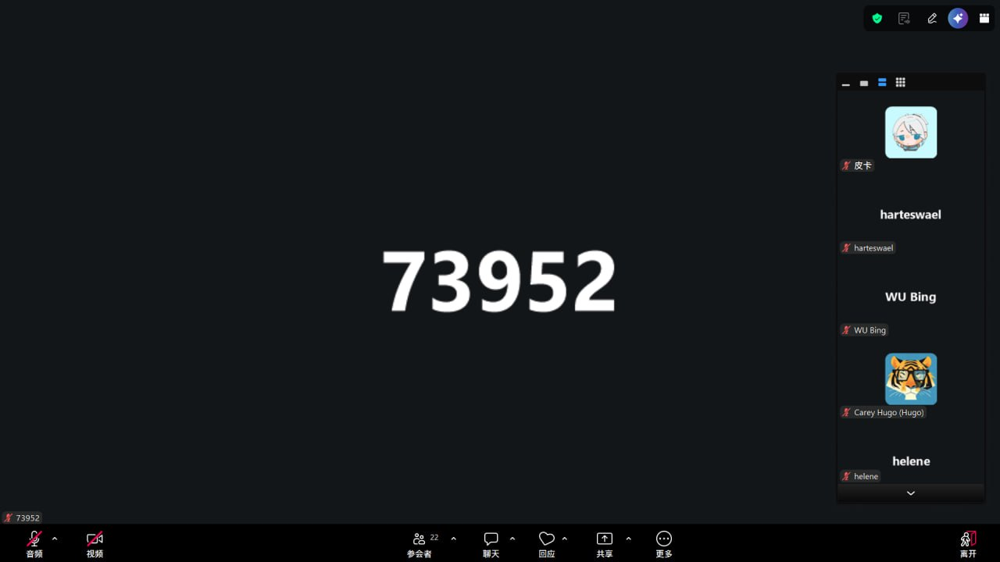

# 2026-05-28 学习笔记

## 今日课程

- 📖 Week 2 Co-learning Live（5.28）
- 🔗 腾讯会议实时参加

## 学习内容

### Week 2 Co-learning Live｜实时参加

- **参与截图**：

#### 关键收获

今晚的 Co-learning 继续围绕 AI Agent 与 Web3 的交叉实践展开。一个比较有意思的讨论点是如何让 Agent 具备"链上感知能力"——不只是读取链上数据，而是能理解交易上下文、识别风险、做出判断。这让我重新思考之前做 Agent 钱包方向时对"智能"的定义：智能不只是自动执行，更关键的是在合适的时机做出合适的决策。下一步打算把这部分思考整理到 Hackathon 的方案设计里，把 Agent 的决策逻辑写得更具体一些。

## 打卡

- [ ] 已提交打卡
- 打卡链接：

## 明日计划

- 继续推进 Week 2 模块任务
- 整理 Hackathon 方案中 Agent 决策逻辑部分
