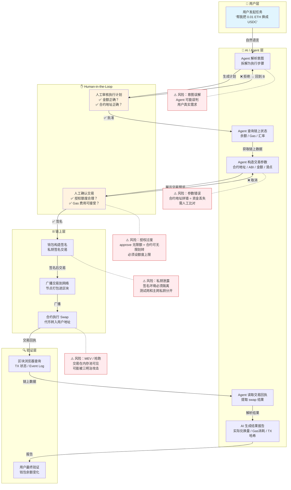

# AI × Web3 最小交叉流程图

> **场景：** 用户用自然语言让 AI Agent 在测试网完成一笔代币兑换（Swap），并自动验证结果。
> **方向：** Agent Wallet + Machine Payment

---

## 流程图

---

## 流程说明

### 1. 这个流程解决什么问题

让一个不会写代码的用户，用一句话（自然语言）驱动 AI Agent 完成链上代币兑换，从解析意图到交易签名到结果验证全程覆盖。核心解决的是 **AI 的理解能力 + Web3 的执行能力** 的衔接问题——AI 知道自己要做什么但做不到链上操作，钱包能做链上操作但不会理解用户的模糊意图。

### 2. 哪些步骤由 AI / Agent 辅助

- **意图解析（B）：** Agent 把「帮我把 ETH 换成 USDC」拆成查余额→查汇率→构造 Swap 交易→发送→验证
- **链上查询（C）：** Agent 通过 RPC 读余额、Gas Price、DEX 报价
- **参数构造（D）：** Agent 拼装合约 ABI、函数调用、金额（wei 单位转换）
- **回执解析（K）：** Agent 从交易回执里提取实际兑换量、Gas 消耗
- **报告生成（L）：** 用自然语言告诉用户发生了什么

### 3. 哪些步骤必须人工确认

- **执行计划审核（E）：** Agent 生成计划后，人必须确认金额、合约地址、操作步骤正确——这一步不可跳过
- **交易签名前确认（H）：** 钱包弹窗展示的实际交易内容（接收地址、金额、Gas），人必须肉眼核对后再签名

> 这两个确认点是 Human-in-the-Loop 的硬边界，过了就不能撤回。

### 4. 如何验证最终结果

- **链上验证：** 在区块浏览器（Etherscan）输入 TX 哈希，查看交易状态、Event Log（Transfer 事件确认代币到账）
- **钱包验证：** 刷新钱包余额，确认 USDC 增加、ETH 减少（扣除 Gas）
- **Agent 报告验证：** Agent 生成的报告与链上数据交叉比对

### 5. 主要风险点

| 风险 | 阶段 | 后果 | 防护 |
|------|------|------|------|
| 意图误解 | 解析 | Agent 执行了错误的操作 | 人工审核计划 |
| 合约地址错误 | 参数构造 | 资金打入错误合约，永久丢失 | 地址白名单 + 人工比对 |
| 授权过度（approve） | 签名 | 恶意合约无限划转 | 精确授权额度，用完 revoke |
| 私钥泄露 | 签名 | 钱包被完全控制 | 测试网/主网隔离，硬件钱包 |
| MEV 抢跑 | 广播 | 交易被三明治攻击，滑点损失 | 设置滑点保护，使用 Flashbots |

---

## 设计思路

选择 Swap 场景是因为它是 **AI × Web3 最简洁但覆盖最全的交叉点**：

- 涉及 AI 能力：意图理解、链上数据查询、参数计算、结果解释
- 涉及 Web3 能力：钱包签名、交易广播、合约调用、区块验证
- 涉及安全边界：授权额度、地址校验、私钥隔离、Human-in-the-Loop

而且这个流程可以**直接扩展**到更复杂的 Agent 场景——比如 Agent 自动复投、Agent 多签资金管理、Agent 订阅支付——核心骨架不变，只是增加策略层和权限层。
